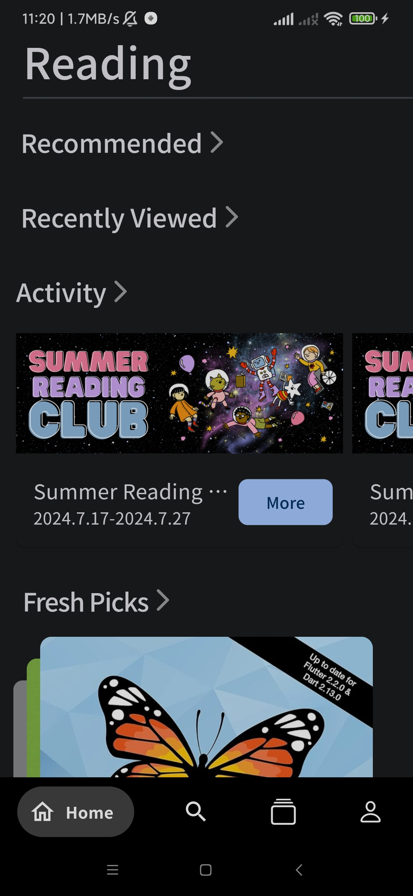
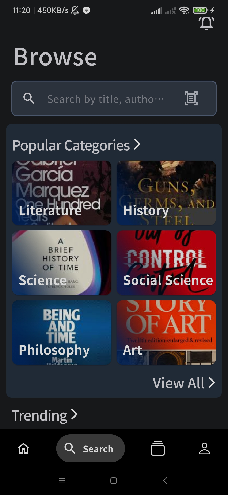
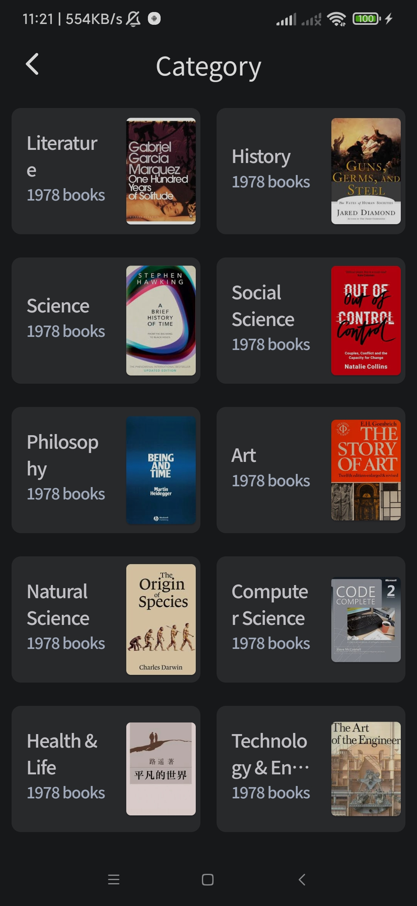
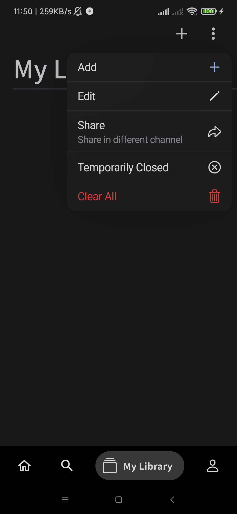
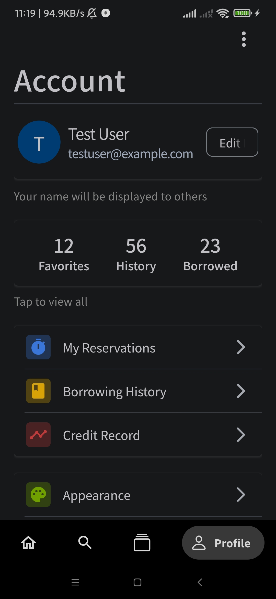

# elib

An mobile e-library to simplify the uni-library experience.

## Features

- Scan book QR codes for easy borrowing and returning
- Search for books by title, author, or category
- Browse books by categories and get recommendations
- Rate and review books
- View borrowing history and manage your personal account
- Receive notifications about library events and activities
- i18n support for multiple languages: English, German, Chinese

## Screenshots

  
  
  
  
  

## Getting Started

You can log in using the following test account:

- **Email**: testuser@example.com
- **Password**: testpass123

Note: The backend server is currently under development. If you'd like to create your own account, you'll need to run the server locally. However, as the server is not yet fully complete, we recommend using the test account for now.
